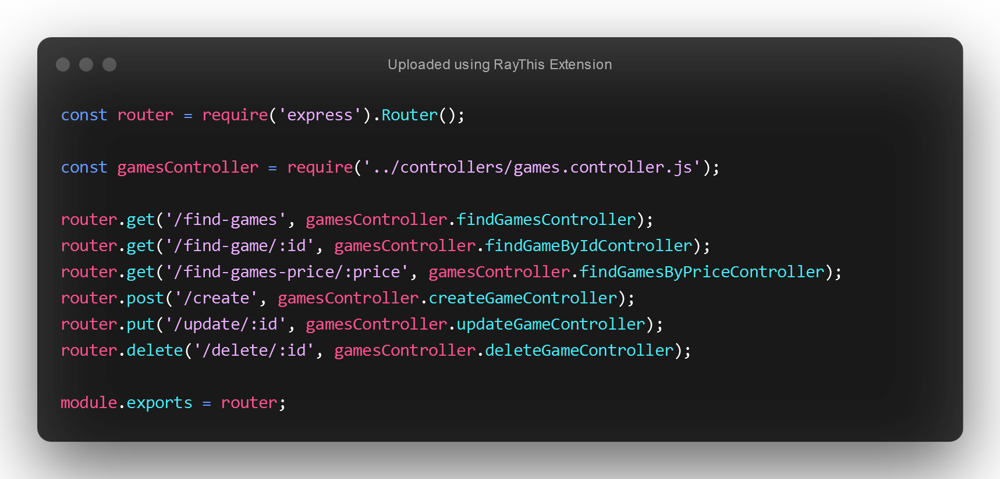
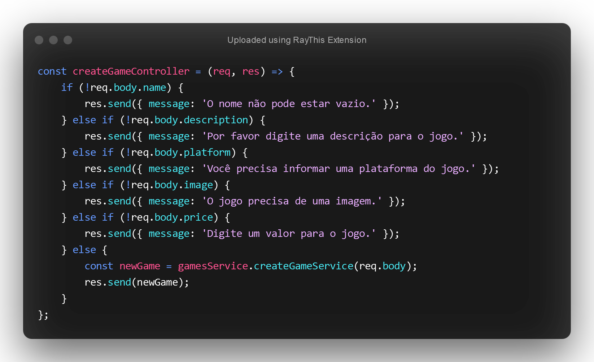
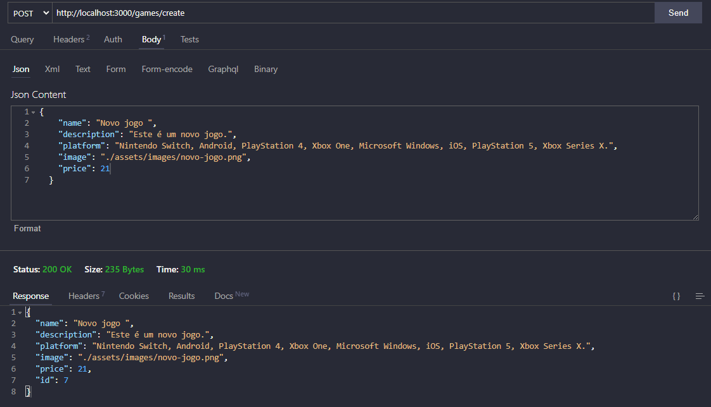

<body>
        <h1>Projeto API Games</h1>
        

                
                
                
        

        <h2 style="margin-top:2rem">Descrição do Projeto</h2>
        

        Este foi o primeiro Projeto desenvolvido no terceiro módulo do curso de programação back-end da Blue EdTech.
        O foco do projeto foi criar uma API em que realize todas as operações do CRUD. 
        A API criada possui uma lista com 6 jogos já salvos em um array de objetos. O create, update e delete são feitos em memória. Neste projeto não foi utilizado nenhum banco de dados.
        

        <h2 style="margin-top:2rem">As Stacks utilizadas foram:</h2>
        

               
JavaScript

               
Node.Js

               
Express

               
Json

               
Nodemon

        

        <h2 style="margin-top:2rem">Desenvolvedor</h2>
        <h3>Lucas Marques</h3>
        <a href="https://www.linkedin.com/in/mlucasdev/">
                Meu Linkedin
        </a>
        

</body>